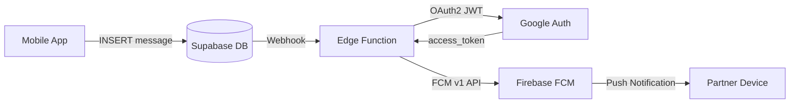

# Design

## Architecture

## Environment Variables

| Variable | Source | Where set |
|---|---|---|
| `SUPABASE_SERVICE_ROLE_KEY` | Supabase Dashboard > Settings > API | `supabase secrets set` |
| `FIREBASE_PROJECT_ID` | Firebase Console | `supabase secrets set` |
| `FIREBASE_CLIENT_EMAIL` | Firebase service account | `supabase secrets set` |
| `FIREBASE_PRIVATE_KEY` | Firebase service account | `supabase secrets set` (with escaped newlines) |
| `CLOUDFLARE_TUNNEL_TOKEN` | Cloudflare Dashboard | `.env` |

## Tunnel Flow

1. `cloudflared` opens reverse tunnel to Cloudflare edge
2. Cloudflare DNS CNAME record points `functions.couplespace.app` to tunnel
3. Supabase webhook sends POST to `https://functions.couplespace.app/send-notification`
4. Request routes through tunnel to cloudflared daemon, which proxies to Supabase Functions endpoint
